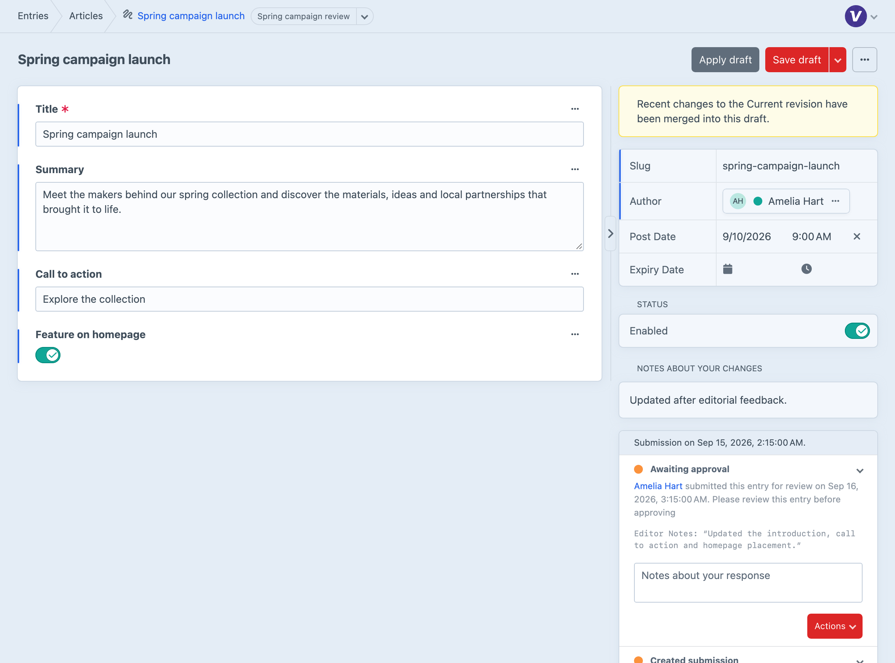
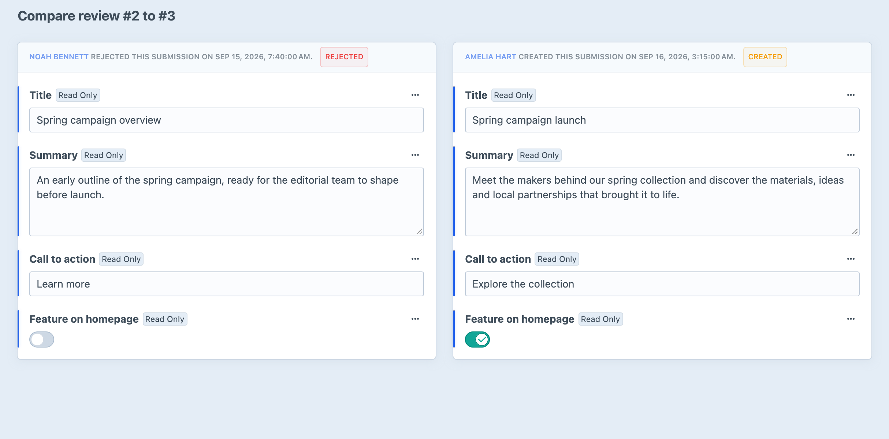
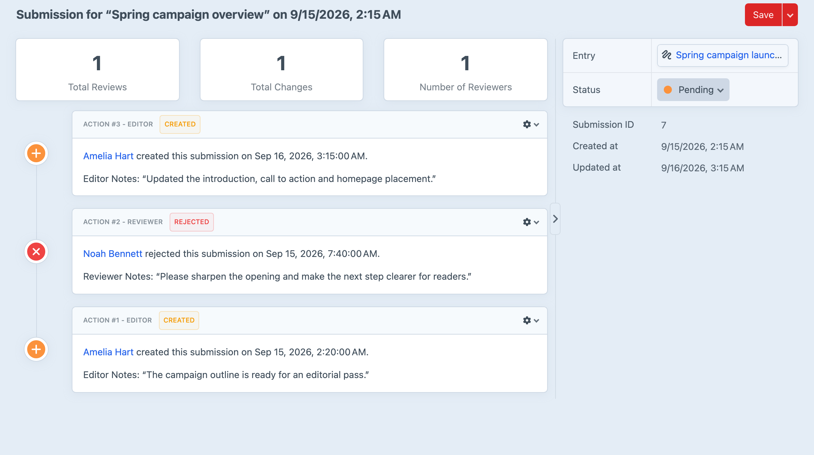

<!-- feature-intro -->
A common publishing setup lets editors create and change content without putting it live themselves. Workflow gives that work a clear submission and review path before a publisher makes it public.
<!-- feature-intro-end -->

<!-- feature-section media-size="large" -->
## Submit for review

Editors write and edit content in Craft drafts, then submit an entry when it is ready for review. The submission records the hand-off and locks it against further changes while a reviewer decides what happens next.

<!-- feature-section-end -->

<!-- feature-section media-size="large" -->
## Clear approval decisions

Publishers receive an email when content is waiting, review the proposed changes, and accept or reject the submission with comments. When more work is needed, the editor gets a clear response and the process begins again.

<!-- feature-section-end -->

<!-- feature-section media-size="large" -->
## Multiple reviewers

Add one or more reviewer groups between editors and publishers for senior editorial, legal or subject-matter approval. A draft summary gives the team a quick overview of work that has not yet reached publication, while self-approval rules and extension actions adapt the process to the project’s responsibilities.

<!-- feature-section-end -->
